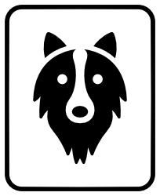

# Collie

`version 0.1.0-rc2`



_A base box modelling to create columns layouts._

Sometimes you don't need a gridsystem framework to use columns layout.

Collie is a simple mixin for stylus that will give you the base box modelling to do this. It let you choose the technique (`float`, `inline-block` or `table`), the gutter value and the amount of columns.

It was born from the need of projects with multiple grids defined or no grid at all. Instead of creating a main amount of columns, gutter value, etc. You just use it as it is needed.

## Install

1. Install collie: `npm install mcarneiro/collie#0.1.0-rc2 --save`;
2. Add it into your file `@require "collie";`;
3. Call the mixin `collie()` inside your element;

## collie()

All parameters are optional. By default it'll create a `float` technique, 2 column with 10px gutter module:

```
.my-holder {
    collie();
}
```

will output to:

```
.my-holder {
  margin-left: -10px;
}
.my-holder:after {
  clear: both;
  content: "";
  display: table;
}
.my-holder > .col {
  margin-left: 10px;
  width: calc(50% - 10px);
  float: left;
}
```

Your HTML can be:

```
<div class="my-holder">
  <div class="col my-module"> ... </div>
  <div class="col my-module"> ... </div>
</div>
```

You can place the amount of columns:

```
.my-holder {
    collie(4);
}
```

and it'll output the width as `calc(25% - 10px)`.

Just set the `$gutter` parameter to change the gutter:

```
.my-holder {
    collie(4, $gutter: 20px);
}
```

Changes in the output will be:

```
.my-holder {
  margin-left: -20px;
}
.my-holder:after {
  clear: both;
  content: "";
  display: table;
}
.my-holder > .col {
  margin-left: 20px;
  width: calc(50% - 20px);
  float: left;
}
```

Set `$type` to change the box modelling technique:

```
.my-holder {
    collie(4, $type: "inline-block");
}
```

and it'll output:

```
.my-holder {
  margin-left: -10px;
  font-size: 0;
  margin-top: -10px;
}
.my-holder > .col {
  margin-left: 10px;
  width: calc(25% - 10px);
  display: inline-block;
  font-size: 16px;
  margin-top: 10px;
  vertical-align: top;
}
```

Notice that it uses the `font-size: 0` technique to avoid space between the elements. You can set the value of font-size with parameter `$ib-font-size`. Ex.: `collie(4, $type: "inline-block", $ib-font-size: 12px);`.

It also will use gutter to apply to the `margin-top`, as inline-block is usually used for lists with multiple lines.

To use `table` technique, `.col` will need to be a wrapper and you'll need to add a `.row-w` element. Ex.:

```
.my-holder {
   collie($type: "table"); 
}
```

It'll output:

```
.my-holder {
  margin-left: -10px;
}
.my-holder > .row-w {
  display: table;
  width: 100%;
}
.my-holder > .row-w > .col {
  display: table-cell;
  padding-left: 10px;
  width: 50%;
}
```

Your HTML will need to be:

```
<div class="my-holder">
  <div class="row-w">
    <div class="col">
      <div class="my-holder">...</div>
    </div>
    <div class="col">
      <div class="my-holder">...</div>
    </div>
  </div>
</div>
```

Responsive behaviour is up to you. Collie will output the basics and you can override anything you want. You can use `collie("reset");` to reset, in case you are using `max-width` or you can use collie only to `min-width`.

Max-width technique:

```
.my-holder {
  collie();

  @media (max-width: 650px) {
    collie("reset");
  }
}
```

It'll output:

```
.my-holder {
  margin-left: -10px;
}
.my-holder:after {
  clear: both;
  content: "";
  display: table;
}
.my-holder > .col {
  box-sizing: border-box;
  margin-left: 10px;
  width: calc(50% - 10px);
  float: left;
}
@media (max-width: 650px) {
  .my-holder {
    margin-top: 0;
  }
  .my-holder > .col {
    margin-top: 10px;
    display: block;
    float: none;
    width: auto;
  }
  .my-holder > .col:first-child {
    margin-top: 0;
  }
}
```

Min-width technique:

```
.my-holder {
  @media (max-width: 650px) {
    > .col {
      margin-top: 10px;
      
      &:first-child {
        margin-top: 0;
      }
    }
  }
  @media (min-width: 651px) {
    collie();
  }
}
```

Will output to:

```
@media (max-width: 650px) {
  .my-holder > .col {
    margin-top: 10px;
  }
  .my-holder > .col:first-child {
    margin-top: 0;
  }
}
@media (min-width: 651px) {
  .my-holder {
    margin-left: -10px;
  }
  .my-holder:after {
    clear: both;
    content: "";
    display: table;
  }
  .my-holder > .col {
    box-sizing: border-box;
    margin-left: 10px;
    width: calc(50% - 10px);
    float: left;
  }
}
```

## collie-width()

This function is only a wrapper to create the `calc` call. It'll make your life easier when you want to change the size of a column:

```
.my-holder {
  collie(4);

  > .col:first-child {
    width: collie-width(percentage(3/4));
  }
}
```

The `first-child` of column will output:

```
.my-holder > .col:first-child {
  width: calc(75% - 10px);
}
```

You can set the gutter using the second parameter: `collie-width(50%, 20px)`.

## collie-set()

You can set the default parameters to collie. Available values are:

```
collie-set("col-wrapper-name", ".custom-col");
collie-set("row-wrapper-name", ".custom-row"); // only used by table technique
collie-set("ib-font-size", 12px); // only used by inline-block technique
collie-set("type", "inline-block");
collie-set("gutter", 20px);
```

By doing this, when writing:

```
.example {
  collie();
}
```

The output will be:

```
.example {
  margin-left: -20px;
  font-size: 0;
  margin-top: -20px;
}
.example > .custom-col {
  margin-left: 20px;
  width: calc(25% - 20px);
  display: inline-block;
  font-size: 12px;
  margin-top: 20px;
  vertical-align: top;
}
```

## Examples

Learn by doing: check and play with the examples on this codepen: http://codepen.io/mcarneiro/pen/GNjoXa?editors=1100

## TODO

* SASS version;
* Publish "legacy" (ie8+) version;

## How to contribute

Every help is welcomed, you can test and open issues or create pull request.

Clone the project and:

* Run `npm install` and `npm run watch` to compile example files;
* Run `npm test` to run unit tests;
* Follow the present code style;
* Keep it lint free and create the relevant unit tests;
* Update the docs and example pages with relevant information;

_\*Border collie icon was made by [Freepik](http://www.freepik.com) from [www.flaticon.com](http://www.flaticon.com) is licensed by [CC 3.0 BY](http://creativecommons.org/licenses/by/3.0/)_
